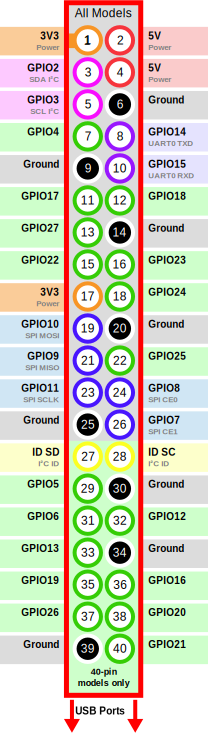

# Parking Management System

This project demonstrates a parking spot monitoring system using Raspberry Pi GPIO sensors and Firebase Realtime Database.

### Installation

First, navigate into the project directory:

```bash
cd parking-system
```

Setup a virtual environment
```bash
python -m venv venv --system-site-packages
. venv/bin/activate
```
Install requirements

```bash
pip install -r requirements.txt
```
## Configuration

Before running the application, you need to configure your Firebase credentials:

1. Go to the [Firebase Console](https://console.firebase.google.com/).
2. Select your project.
3. Navigate to `Project settings` > `Firebase Admin SDK`.
4. Click on "Generate new private key" and save the file as `key.json` to your project directory.

## Run the application

Finally, run the application:

```bash
python app.py
```

## Features

- Real-time GPIO sensor monitoring for parking spot occupancy
- Firebase Realtime Database integration for data storage
- Automatic updates only when parking status changes
- TLS secure connection to Firebase
- Continuous monitoring with 1-second polling interval

## Pinout for Raspberry Pi 4 GPIOs  
  
  