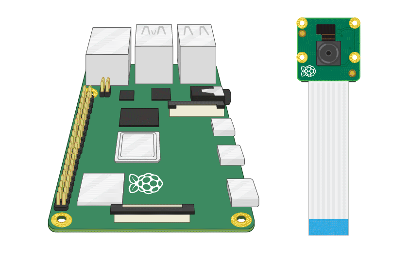

# Home Security - Face Detection

### Installation

First, navigate into the project directory:

```bash
cd 4_face-detection
```

Setup a virtual environment
```bash
python -m venv venv --system-site-packages
. venv/bin/activate
```
Install requirements

```bash
pip install -r requirements.txt
```


## Creating Dataset

Switch to the remote desktop through `VNC Viewer` and open a new terminal  
Navigate into the project directory  
Activate venv

```bash
cd 4_face-detection
. venv/bin/activate
```
Run `collect_imgs.py` to capture pictures of yourself
```bash
python collect_imgs.py
```

## Train the recogniser

```bash
python train.py
```

## Run the application

Finally, run the application:

```bash
python app.py
```

The video stream is served at `http://<raspberry-pi-ip>:8000/`.

## Notes

- Update the `names` list in `detect_faces.py` to match your dataset IDs.

## Connecting Camera To Raspberry Pi 4 
  
  